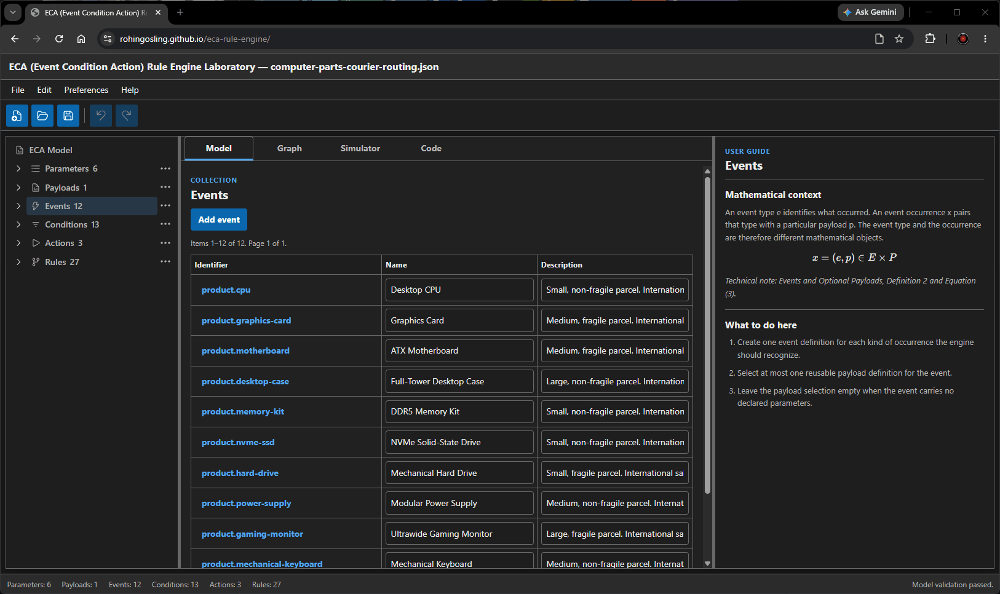

# **Stateless ECA Rule Engine**<br>Model Laboratory


[](https://rohingosling.github.io/eca-rule-engine/)

## 📚 Contents

- [📚 Contents](#-contents)
- [🔎 Overview](#-overview)
- [🧪 Model Laboratory](#-model-laboratory)
- [📐 Technical Note](#-technical-note)
- [☕ Java Reference](#-java-reference)
- [🔗 Resources](#-resources)

## 🔎 Overview

This project defines and implements a minimal, stateless event-condition-action rule engine. It combines a domain-independent mathematical semantics, a browser-based model laboratory, and Java and TypeScript reference implementations governed by shared JSON Schemas and conformance fixtures.

The engine selects at most one symbolic action for the current event occurrence. It does not execute that action, retain event history, resolve conflicts by rule order, or depend on mutable application state.

## 🧪 Model Laboratory

The [model laboratory](https://rohingosling.github.io/eca-rule-engine/) creates and validates ECA models, displays rule graphs and canonical JSON, and evaluates event occurrences in a local Web Worker. Its Model, Graph, Simulator, and Code views are shown in the animated preview above.

Models remain in the browser unless the user explicitly saves or exports them. The hosted application has no project API, database, service credential, or server-side rule evaluation.

## 📐 Technical Note

The [Stateless ECA Rule Engine](docs/technical-note/stateless-eca-rule-engine.pdf) technical note gives a minimal, domain-independent semantics for occurrence-local ECA evaluation.

### Event Definition

Let $\mathcal E$ be the set of event types and $\mathcal P$ the set of payloads. An event occurrence pairs the type of what occurred with the payload supplied for that particular occurrence; $(e,\varnothing)$ denotes an event with no payload.

```math
x=(e,p)\in\mathcal X=\mathcal E\times\mathcal P.
```

#### Paramter Definition

Let $K$ be the set of parameter names and $V$ the set of parameter values. For a payload $p$, a parameter name $k$ is present exactly when $k\in\mathrm{dom}(p)$, in which case its value is $p(k)$.

```math
K\coloneqq\{\mathrm{parameter\ names}\},\qquad V\coloneqq\{\mathrm{parameter\ values}\}.
```

#### Payload Definition

A payload is a finite partial function from parameter names to parameter values. The empty function $\varnothing\in\mathcal P$ represents no payload.

```math
p:K\rightharpoonup V,\qquad p\in\mathcal P.
```

### Condition Definition

Let $\mathcal C$ be the set of conditions. Every condition $c\in\mathcal C$ has a finite dependency set $K_c$ containing the payload parameters that the condition may use.

```math
c\in\mathcal C,\qquad K_c\subseteq K,\qquad |K_c|<\infty.
```

#### Conditon Predicate Definition

The condition predicate is a total function that returns $1$ when condition $c$ is true for payload $p$ and $0$ when it is false. A missing required parameter makes the condition false.

```math
q:\mathcal C\times\mathcal P\longrightarrow\{0,1\},\qquad K_c\nsubseteq\mathrm{dom}(p)\Longrightarrow q(c,p)=0.
```

### Action Definition

Let $\mathcal A$ be the set of actions. The distinguished value $\bot$ denotes no action and is not itself an action.

```math
a\in\mathcal A,\qquad \mathcal A_\bot=\mathcal A\cup\{\bot\},\qquad \bot\notin\mathcal A.
```

### Rule Definition

A rule is a triple that states that action $a$ is a candidate when an event of type $e$ occurs and condition $c$ is true. A rule set is a subset of all such triples.

```math
r=(e,c,a)\in\mathcal E\times\mathcal C\times\mathcal A,\qquad R\subseteq\mathcal E\times\mathcal C\times\mathcal A.
```

#### Rule Evaluation Predicate Definition

The Boolean predicate $M$ tests whether an action is identified by at least one rule matching the current event type whose condition is true. The candidate-action set $C_R(e,p)$ contains every action that satisfies this predicate.

```math
\begin{aligned}
M&:\mathcal X\times 2^{\mathcal E\times\mathcal C\times\mathcal A}\times\mathcal A\longrightarrow\{0,1\},\\
M((e,p),R,a)=1&\Longleftrightarrow\exists c\in\mathcal C:(e,c,a)\in R\land q(c,p)=1,\\
C_R(e,p)&=\{a\in\mathcal A\mid M((e,p),R,a)=1\}.
\end{aligned}
```

### Stateless ECA Rule Engine Definition

Let $\mathfrak S$ be the set of all rule sets and $\mathfrak D_q$ the inputs whose candidate-action set contains at most one action. The partial query $Q$ is defined exactly on $\mathfrak D_q$ and returns the unique candidate action, or $\bot$ when there is none; it is undefined when distinct actions are candidates.

```math
\begin{aligned}
\mathfrak S&=2^{\mathcal E\times\mathcal C\times\mathcal A},\\
\mathfrak D_q&=\left\{((e,p),R)\in\mathcal X\times\mathfrak S\ \middle|\ |C_R(e,p)|\leq 1\right\},\\
Q&:\mathcal X\times\mathfrak S\rightharpoonup\mathcal A_\bot,\qquad \mathrm{dom}(Q)=\mathfrak D_q,\\
Q((e,p),R)&=
\begin{cases}
a, & C_R(e,p)=\{a\},\\
\bot, & C_R(e,p)=\varnothing.
\end{cases}
\end{aligned}
```

#### Statelessness Definition

A possibly history-dependent behaviour maps a finite history and current occurrence to an optional action. It is stateless exactly when its result for the current occurrence is identical for every prior history.

```math
G:\mathcal X^*\times\mathcal X\longrightarrow\mathcal A_\bot,\qquad \forall h_1,h_2\in\mathcal X^*,\ \forall x\in\mathcal X:\ G(h_1,x)=G(h_2,x).
```


## ☕ Java Reference

The Java 21 reference implementation includes a pure evaluator, model compiler, command-line interface, and optional Quarkus HTTP adapter. Java and TypeScript run the same language-neutral conformance corpus so their validation, evaluation, diagnostic, and trace behavior remains aligned.

## 🔗 Resources

- [Stateless ECA Rule Engine (PDF)](docs/technical-note/stateless-eca-rule-engine.pdf)
- [Model Laboratory](https://rohingosling.github.io/eca-rule-engine/)
- [Project Wiki](https://github.com/rohingosling/eca-rule-engine/wiki)
- [Java Reference](apps/server/README.md)
- [JSON Schemas](contracts/schemas/README.md)
- [Conformance Fixtures](contracts/conformance/README.md)
